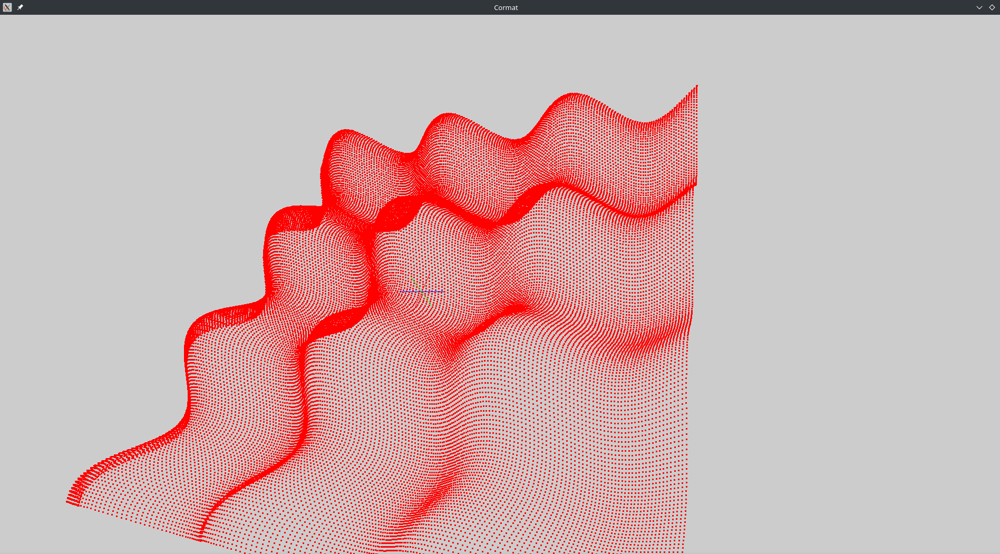
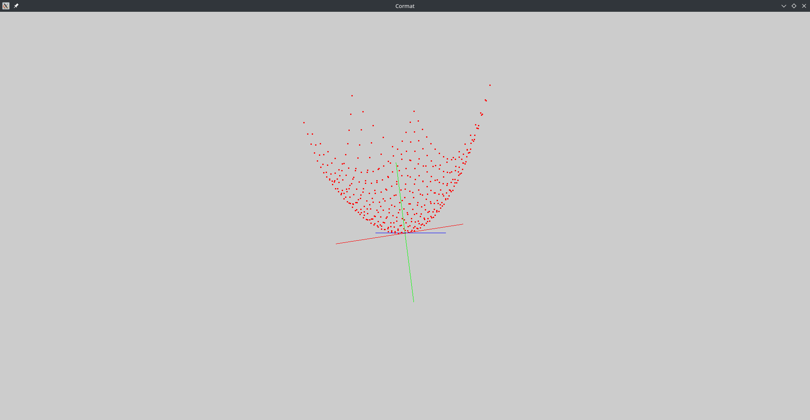
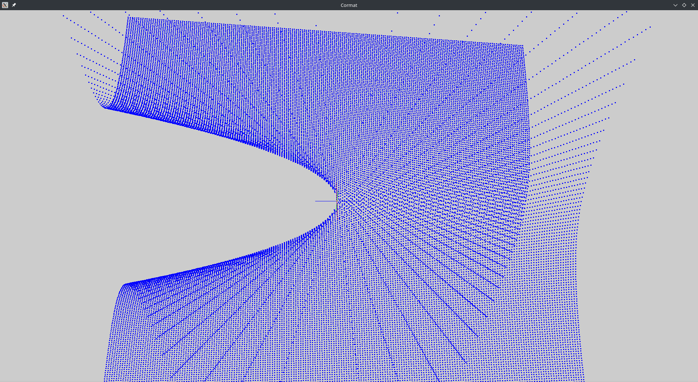

### The project will be repurposed as a 3D Physics Engine!! (README not yet changed)
# About the project (In development)   
**Cormat** is a graphical 3D math software intended for visualizing mathematical functions. In the future, I am planning to make this project expand to a 3D engine, mainly for physics simulations. Currently, it only is a graph software.
# IMPORTANT
If you want to change the function that is drawn, **You must change the source code**. Goto **src** directory, find the **graph.cpp**, go all the down to the **pointGenerator()** function. Change the parameters of the function (there are comments that explains how it works), and recompile the project. Inputting different functions is a bit tricky, and I am working on it.
# Roadmap
I want to remind you that I am also very busy with my other projects. Therefore the development will be slow, especially the simulation part, since I have to learn lots of new things to do that.
* **Function Inputs** see the **IMPORTANT** header above.
* ~~**Rotation input** Change the way the rotation of the graph is handled, change the cursor type to the visible.~~
* ~~<span style="color:red">**IMPORTANT BUG:**</span> Whenever the program is run, there is a change it throws a segmentation fault. With running multiple times, eventually it be run succesfully.~~ The bug is fixed now.
* ~~**User Interface, ImGui** A small settings window to change the settings of the graph~~
*~~**0.1.0 Release** After the implementation of ImGui, the verison 0.1.0 will be ready.~~
* ~~**MAIN CORE** A point generator from mathematical functions to draw the graphs.~~
* **BINARIES** Precompiled binaries for WINDOWS/LINUX (arch/ubuntu)/MACOS. This will be done after the verison 0.1.0 release
* ~~**CMAKE** currently the way I generate my make files are in mess. I am planning to completely change the structure of cmake~~
* **CMAKE second change** As the project gets bigger, I will transition to nested cmake structure. For now, only one simple txt is enough.
* **2D/3D mode** A feature to change between the dimensions
* **Polyhon/Line/Point mode** A feature to change between the style of the graph
* **Anti-aliasing** To increase the details of the graph, making individual pixels more invisible
* **FUTURE** I have not yet planed it in detail, but the software will have simulation features
# Dependecies
* [OpenGL](https://www.khronos.org/opengl/wiki/Getting_Started#Downloading_OpenGL)  API for rendering 2D-3D graphics
* [GLFW](https://github.com/glfw/glfw) API for creating windows, reading input and handling events. **CMAKE AUTOMATICALLY INSTALLS LOCALLY VIA GIT**
* [stb_image](https://github.com/nothings/stb/blob/master/stb_image.h) for textures
* [GLM](https://github.com/g-truc/glm) for linear algebra, trigonometry and calculus.
* [CMAKE](https://cmake.org/about/) to generate make files
* [GCC](https://gcc.gnu.org/install/) to compile the project

# Shortcuts
* Use mouse to rotate the graph
* Use mouse scrool to zoom in and out
* Use W,A,S,D to move around
# Build
**NOTE:** I only tested this program for linux, be vary.
To build and run, run these commands.
```
git clone https://github.com/JosephMehdiyev/cormat
cd cormat # the directory may vary, just cd to the project root
mkdir build
cd build
cmake --preset release -S ../ -B . # you may also use --preset debug or --preset default, release is recommended
make
./cormat
```
I only compiled this in Linux ARCH. I did not test this program on other distros.
There are no system specific code in the project (yet? imgui may give error). I believe it should run smoothly on all the popular systems.
In future, there will be precompiled binaries for WINDOWS/LINUX/MACOS. Do not worry!
# Gallery (I will redesign the structure for better aesthetics)
sin(x) + cos(y)

x^2 + y^2

x/y

# License
The project is licensed under the GNU GENERAL PUBLIC LICENSE.


